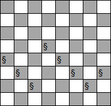
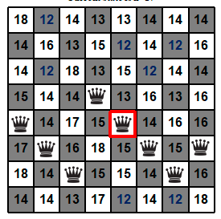
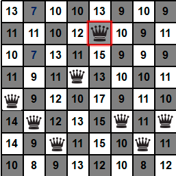
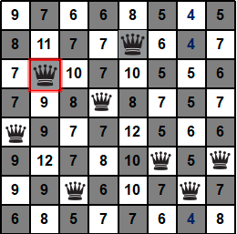
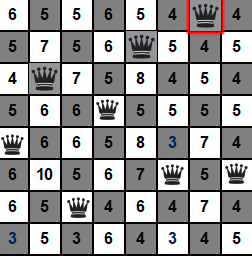
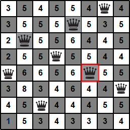
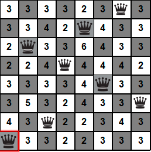

# N Queens Problem

In many real-world problems, the path to the goal state is usually not very relevant to the goal. In the search algorithms that are available, the algorithms maintain one or more paths in memory and need to keep track of which nodes have been expanded. In fact, in some problems this is not necessary at all. For example, in problems where the focus is on the state of the solution, there is no need to consider the cost of the path to the goal, e.g., in the Eight Queens problem, the focus is on the final state of the eight queens, not on the order in which the queens are placed.

Problem: see the [exercise](./docs/exercise.md).

## Local Development

Environment requirements:

- [Python](https://www.python.org/): 3.8+

Clone the repository:

```shell
git clone https://github.com/cworld1/nqueens-problem.git
```

Run the code:

```shell
cd nqueens-problem
python main.py
```

### Time efficiency

To know the time efficiency of each solution way, you can run this script:

```shell
python ./generate_table.py
```

Example of the result:

```log
# queens        method          Average # of nodes +/- std dev  Average time to solve +/- std dev       Probability of solv
ing
8 queens
                hillclimbing    7.00 +/- 0.00                           0.0064 +/- 0.0007               0.00
                sideways        17.00 +/- 0.00                          0.0177 +/- 0.0014               0.00
                randomrestart   32.70 +/- 14.16                         0.0362 +/- 0.0158               0.70
9 queens
                hillclimbing    8.00 +/- 0.00                           0.0126 +/- 0.0016               0.00
                sideways        19.00 +/- 0.00                          0.0310 +/- 0.0025               0.00
                randomrestart   32.40 +/- 15.06                         0.0531 +/- 0.0254               0.80
10 queens
                hillclimbing    11.00 +/- 0.00                          0.0267 +/- 0.0029               0.00
                sideways        21.00 +/- 0.00                          0.0554 +/- 0.0059               0.00
                randomrestart   48.30 +/- 20.46                         0.1240 +/- 0.0561               0.40
```

### Original code

If you want to know the difference to original code, you can run the following command:

```shell
python ./original/test.py
```

## Contributions

To spend more time coding and less time fiddling with whitespace, this project uses code conventions and styles to encourage consistency. Code with a consistent style is easier (and less error-prone!) to review, maintain, and understand.

## License

This project is licensed under the GPL 3.0 License.

# Content

在现实中的很多问题中，到达目标状态的路径通常与目标关系不大。在已掌握的搜索算法中，算法均会在内存中维护一条或更多条的路径，并需要记录有哪些节点已被扩展。而事实上，在一些问题中这样做完全是没必要的。如在那些【重点是解的状态】的问题中，就不需要考虑到达目标的路径 cost。如在八皇后问题中，重点是【八个皇后的最终状态】，而非放置八个皇后的顺序。

## 局部搜索

若到达目标的路径 cost 不是关注的重点时，解决问题的搜索算法就必须适应这种变化，即算法不考虑路径问题。可以这样做：只维护一个【当前的状态】，而非多条路径，然后不断改善当前状态直至达到目标状态。这样做的优点如下：

1. 不需要维护搜索树；
2. 占用内存少（因为不用存储路径之类的数据结构了）；
3. 在连续的并且状态空间很大的问题中，通常都可以找到足够好的解。

局部搜索算法考虑对一个或多个状态进行评价、改善、修改，而不是系统地探索从初始状态开始的路径。局部搜索算法对解决纯粹的最优化问题十分有用，算法的目标是根据估价函数或者目标函数找到最佳状态。

看下面的图片，横坐标为当前状态，纵坐标为状态对应的目标函数值（此时算法的目标是找到全局最大值，即状态最优）或者代价函数值（此时算法的目标是找到全局最下值，即要 cost 最小），可以通过插入负号来进行二者之间的转换：


局部搜索就是探索上面的地形图。若存在解，则完备的局部搜索算法总能找到解，而完备的局部搜索算法总能找到全局最优解；

## 全局搜索与局部搜索的区别

1. 局部搜索算法只在单个当前节点上运作，而不是像全局搜索那样系统地在多条路径上探索，并且前者只在当前节点的相邻状态即后继状态之间移动；
2. 通常情况下，局部搜索不保留搜索过程中经过的路径，换句话说，它不关心实现的路径；而全局搜索则必须保留路径；
3. 在连续的并且状态空间很大甚至无限的问题中，局部搜索通常都可以找到足够好的解，但是这样的问题不适合用全局搜索算法解决。

## 爬山法

下面为最陡峭上升的爬山法的代码：


先介绍八皇后问题：有一个 8 乘 8 的棋盘，现在要将八个皇后放到棋盘上，满足：对于每一个皇后，在自己所在的行、列、两个对角线都没有其他皇后。

通常爬山法可以以很快的速度找到问题的解，因为一般从较差的状态开始扩展是很容易做到的。但是爬山法经常也会陷入局部最优而难以“自拔”，也就是说在算法执行过程中有可能到达这样一种状态——在这个状态下再也做不到更好的改善了。如在解决八皇后问题中，首先从随机生成的一个上面有八个皇后的棋盘开始，使用最陡峭上升的爬山法（steepest-ascent hill climbing）在 86%的情况下会陷入局部最优，且仅能在 14%的情况下解决问题。爬山法过程比较快，在解决八皇后问题中，平均下来只需四步便可成功得到解，但是同样地，在可能在第三步就陷入了局部最优。但是对于状态空间大小为 $88=16777216≈1.7*107$ 的八皇后问题，爬山法表现也还可以。爬山法不用维护搜索树，因此对于当前节点来说，记录的仅有节点对应的状态与目标函数的值。

下面用爬山法解决八皇后问题，下图为初始状态：



规定 h 为当前棋盘状态下，互相攻击的皇后对数，即 `h=互相攻击的皇后对数` 。如为初始状态的上图的 h=17，即互相攻击的皇后总共有 17 对。限制每个皇后只能在自己所在的列上下移动。

第一步，看下图，还是初始状态的棋盘，只不过棋盘上除了皇后，还有好多数字，解释是这样的——数字代表将自己所在列上的皇后移到自己的格子后的 h。如下图标红的皇后在第五列，若将该皇后移到第五列的第一行时 h=13，若将该皇后移到第五列的第二行时 h=12。下图为初始状态，当前状态的 h=17。



任意状态（包括上面的初始状态）的所有后继状态为【从当前状态开始，将任意一个皇后移到同列的其他 7 个格子后的所有状态】。对于任意一个已有八个皇后的棋盘（当然同一列有且仅有一个皇后）的后继状态均有 $8*7=56$ 个。也就是说，使用爬山法解决八皇后问题时每一步都要算 56 个值。根据上图（初始状态）的数字，可以看出后继状态中 h 最小为 12，共有 7 个 12。爬山法在最优的后继状态不止一个时，通常随机选择其中一个后继状态再继续改善并扩展。那就现在随机选吧，不妨选择第五列的那个皇后，然后将其移到同列的第二行的格子，到第二步。



第二步，看下图，当前状态的 h=12。56 个后继状态的 h 值数字已经写在对应格子上了。可以看出后继状态中 h 最小为 7，共有 2 个 7。现在只能选择第二列的那个皇后，但是可以随机选择移到两个 7 对应的后继状态中的哪一个，不妨将皇后移到同列的第三行的格子，到第三步。



第三步，看下图，当前状态的 h=7。56 个后继状态的 h 值数字已经写在对应格子上了。可以看出后继状态中 h 最小为 4，共有 3 个 4。现在只能选择第七列的那个皇后，但是可以随机选择移到 3 个 7 对应的后继状态中的哪一个，不妨将皇后移到同列的第一行的格子，到第四步。



第四步，看下图，当前状态的 h=4。56 个后继状态的 h 值数字已经写在对应格子上了。可以看出后继状态中 h 最小为 3，共有 3 个 3。那就现在随机选吧，不妨选择第六列的那个皇后，然后将其移到同列的第五行的格子，到第五步。

第五步，看下图，当前状态的 h=3。56 个后继状态的 h 值数字已经写在对应格子上了。可以看出后继状态中 h 最小为 1，只有 1 个 1。只能选择第一列的那个皇后，也只能将其移到同列的最后一行的格子，到第六步。



第六步，看下图，当前状态的 h=1。56 个后继状态的 h 值数字已经写在对应格子上了。可以看出后继状态中 h 最小为 2>1，发现所有的后继状态都比现在差！也就是说当前状态是最好的，再怎么扩展都比现在差，不能再进行下一步了，还没到达目标状态，还没找到最优解，甚至连解都没找到就不得不终止爬山法了！！这时的囧境被称为算法陷入了局部最优，而无法“自拔”！！！



算法到这里已经被迫停止了！

### 为什么爬山法会陷入局部最优

局部最优是指当前状态的估价函数值比自己的所有后继状态的估价函数值都要低，但是当前状态的估价函数值比全局最优解的估价函数值要高。爬山法在到达局部最优的情况时，无法从局部最优中摆脱，无更好的路可走。就上面八皇后问题来说，到了第六步时，算法就是进入了关于估价函数 h 的局部最优状态，任何此状态的后继状态均比现在更差。

正如爬山法的名称一样，算法过程与现实的爬山过程相似，爬山的效率取决于“山的形状”：

1. 只看当前状态的后继状态，或者说只看紧挨着的下一步而不去做除此以外的事情；
2. 为了到达山顶，向着目标——“山顶”不断向上“爬”；
3. 在到达“山峰”（不仅仅是山顶）时停止；
4. 在局部最优或者全局最优解找到时停止“爬山”。

### 爬山法解决八皇后问题的改进方案

#### 允许有一定限制的侧移

在限定的某个次数下，可以允许皇后连续横向移动。比如在八皇后问题中可以允许最多有 100 步连续的侧移。

这种改进方案可以将爬山法解决八皇后问题的成功概率由 14%提升到 94%。

这样的成功是有代价的——爬山法平均下来在第 21 步左右才能成功得到问题的解，但是平均下来大约在第 64 步时就会失败。

不允许侧移的爬山法过程比较快，在解决八皇后问题中，平均下来只需 4 步便可成功得到解，但是同样地，在可能在第 3 步就陷入了局部最优。

若当前状态的估价函数值小于或等于后继状态的估价函数值时，侧移使得算法可以摆脱“高原”，高原指在高处的平原，这种情况下不存在继续“上山”（即朝目标解的方向前进）的出口（还未到达山顶，但是算法走不出去了），称为在高原上“迷路”了。若到达“高原状态”，也就是当前状态的估价函数值等于后继状态的估价函数值时，爬山法就不得不终止了。

如果高原是在“山肩”的高原（上图的 shoulder）时，爬山法还可能取掉更好的进展，允许侧移就是非常好的解决方案。但是还要注意，若允许算法在不能向上的情况下总是可以侧向移动，那如果到达上图的 flat local maximum，即到达一个平坦的局部最优值区域后，算法就会陷入无限的死循环（因为这时 neighbor.value <= current.value 总是成立的）。

#### 随机爬山法

在上面的八皇后问题中，随机地选择从哪个后继状态继续，只不过每个后继状态被选中的概率随估价函数值大小而不同。尽管这样做会导致效率比最陡峭上升的爬山法低，但是在某些状态下，随机爬山法可以找到更好的解。

#### 随机重启爬山法

随机重启爬山法的思想：如果一开始没有成功，那就再试一次，若还没成功就继续尝试。算法从随机产生的初始状态开始，执行一系列的爬山搜索过程，直到找到目标。随机重启爬山法完备的概率接近于 1，即随机重启爬山法大多都可以找到解。
